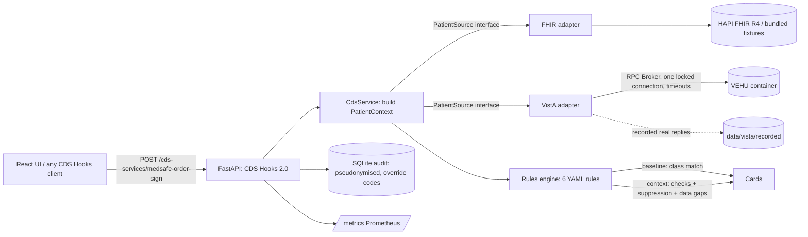

# Architecture

> Prototype, not clinical advice. Synthetic data only.

## Flow of one request

1. The client posts an `order-sign` hook with a `draftOrders` bundle and `context.patientId`. The data source
   comes from `extension["org.medsafe.source"]`; supplied `prefetch` is used when present.
2. The adapter returns FHIR-shaped `Patient`, `MedicationRequest`, `Condition`, `Observation` resources. The
   VistA adapter parses RPC text (`ORWPS ACTIVE`, `ORQQPL LIST`, `ORWLRR INTERIMG`, `ORQQVI VITALS`) into the
   same shapes, so the rest of the system cannot tell which source it is talking to.
3. `build_context` maps drugs to RxNorm ingredients (free-text names handled by the mapper), picks
   `as_of` (`MEDSAFE_AS_OF_POLICY`: wall clock for prefetch data, newest observation for the historical fixtures /
   VEHU), and derives eGFR (CKD-EPI 2021 computed for every creatinine without a same-day reported eGFR, labelled
   `source="computed"`; a reported value on the same day wins). Labs are unit-normalised (creatinine to mg/dL) or dropped,
   range-checked, and only serum/plasma creatinine counts (urine is excluded by specimen and test IEN). A combination
   drug is expanded to one drug per ingredient; a draft that cannot be identified, is non-systemic (topical, ophthalmic,
   flush...), or is only partly recognised gets an explicit info card instead of a silent pass.
4. The engine evaluates each rule. **Baseline**: fire on drug-class match. **Context**: run the rule's named
   check or suppression predicates; emit an actionable card, a suppression record, or a data-gap info card.
5. Cards carry summary, detail, "why" bullets, public source link, suggestions, override reasons, and the
   prototype disclaimer. Feedback (accepted/overridden + reason code) goes to the audit store.

## Failure behaviour

- The VistA broker is stateful and not thread-safe: `BrokerRpcClient` holds one lock (callers wait at most one
  timeout for it), socket timeouts (default 8 s), and a circuit breaker. Sign-on/handshake/context rejections are never
  retried (account-lockout risk) and suspend sign-on for a cool-down; transport failures open the circuit so calls
  fail fast; only a stale *established* connection gets one transparent reconnect. One patient fetch has a total
  deadline and concurrent requests for the same DFN share one fetch (single-flight). `/ready` and `/api/sources` read
  the breaker state and a 10 s cached probe instead of issuing an RPC under the lock. Endpoints are plain `def`
  (run in Starlette's threadpool).
- **Fail open**: if the source is slow or down the response is `{"cards": []}` with an `X-Medsafe-Degraded`
  header, a logged warning, and an audit `source_error` row. Alert-fatigue tooling must never block ordering.
- Per-patient TTL cache (60 s) avoids repeating RPCs across the hook calls of one ordering session.
- In-process token-bucket rate limit (429 + `Retry-After`), `/health` `/ready` `/metrics` exempt.

## Input handling and hardening

- Request payloads are untrusted: nested FHIR fields are type-checked before use, an unusable request or any
  evaluation error fails open (`{"cards": []}` + `X-Medsafe-Degraded`, redacted log line, `source_error` audit row).
  A 422 lists field locations only and never echoes the submitted body.
- Bodies over 1 MB get 413; more than 50 draft orders get 422. VistA patient ids must be digits, and a broker
  reply of "Patient is unknown" is an error (fail open), never an empty record that would produce a "no eGFR" card.
- `MEDSAFE_ENV=production` refuses to start without `MEDSAFE_AUDIT_API_KEY` and a non-default
  `MEDSAFE_PSEUDONYM_SALT`; in dev the same gaps produce startup warnings. The key also protects `/metrics` and
  switches `/docs` off. See the README section "Security and exposure".

## Privacy

Audit rows hold a salted pseudonym of the patient id, rule id/version, outcome, and override code. Free-text
comments are hashed and their length recorded, never stored. Logs carry request ids, not patient identifiers.
