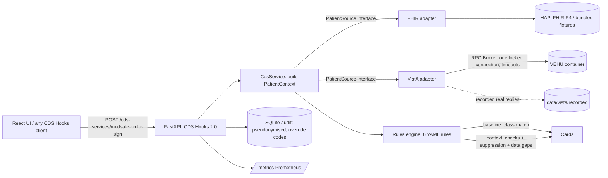

# Architecture

> Prototype, not clinical advice. Synthetic data only.

## Flow of one request

1. The client posts an `order-sign` hook with a `draftOrders` bundle and `context.patientId`. The data source
   comes from `extension["org.medsafe.source"]`; supplied `prefetch` is used when present.
2. The adapter returns FHIR-shaped `Patient`, `MedicationRequest`, `Condition`, `Observation` resources. The
   VistA adapter parses RPC text (`ORWPS ACTIVE`, `ORQQPL LIST`, `ORWLRR INTERIMG`, `ORQQVI VITALS`) into the
   same shapes, so the rest of the system cannot tell which source it is talking to.
3. `build_context` maps drugs to RxNorm ingredients (free-text names handled by the mapper), picks
   `as_of` (default: newest observation in the patient record, so relative windows work for old VEHU dates),
   and derives eGFR (reported wins, else CKD-EPI 2021 computed, labelled `source="computed"`).
4. The engine evaluates each rule. **Baseline**: fire on drug-class match. **Context**: run the rule's named
   check or suppression predicates; emit an actionable card, a suppression record, or a data-gap info card.
5. Cards carry summary, detail, "why" bullets, public source link, suggestions, override reasons, and the
   prototype disclaimer. Feedback (accepted/overridden + reason code) goes to the audit store.

## Failure behaviour

- The VistA broker is stateful and not thread-safe: `BrokerRpcClient` holds one lock, socket timeouts
  (default 8 s), and one reconnect attempt. Endpoints are plain `def` (run in Starlette's threadpool).
- **Fail open**: if the source is slow or down the response is `{"cards": []}` with an `X-Medsafe-Degraded`
  header, a logged warning, and an audit `source_error` row. Alert-fatigue tooling must never block ordering.
- Per-patient TTL cache (60 s) avoids repeating RPCs across the hook calls of one ordering session.
- In-process token-bucket rate limit (429 + `Retry-After`), `/health` `/ready` `/metrics` exempt.

## Privacy

Audit rows hold a salted pseudonym of the patient id, rule id/version, outcome, and override code. Free-text
comments are hashed and their length recorded, never stored. Logs carry request ids, not patient identifiers.
